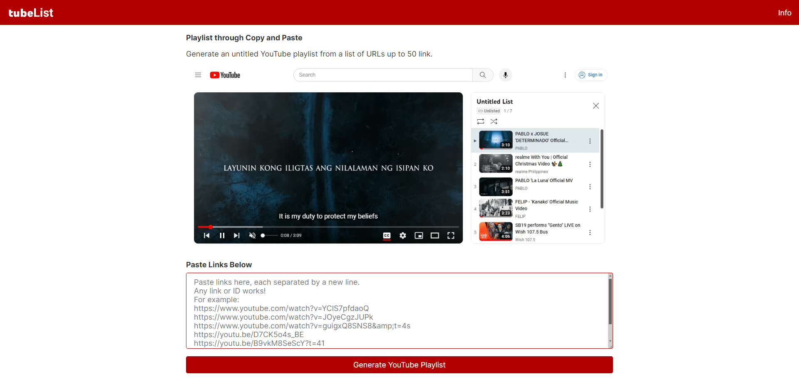

# tubeList

(acronym for Youtube Playlist) Generate an untitled playlist from a list of YouTube URLs.

## What is it?

A tool that generate an untitled playlist from a list of YouTube URLs.

## How to use it?

1. Paste each links separated by a new line.

2. Click the `Generate YouTube Playlist` button and view the untitled playlist.
